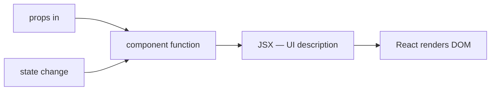

# Why React

## What

React is a library for building user interfaces from components — functions that take data (props) and return UI descriptions. It renders declaratively: you describe what the UI looks like for a given state, and React updates the DOM when state changes.

## Why It Matters

React is a library, not a full framework — routing, state management, and data fetching come from the ecosystem (React Router, Zustand, TanStack Query). That composability made it the largest frontend job market and the lingua franca of UI work. Paired with NestJS, both sides of your app share TypeScript and decorator-free/decorator-heavy styles side by side — the concepts of modules, providers, and typed contracts transfer directly.

## How It Works

### A Component Is a Function

```tsx
function TaskCard({ title, completed }: { title: string; completed: boolean }) {
  return (
    <div className={completed ? 'card done' : 'card'}>
      <h3>{title}</h3>
    </div>
  )
}

export default TaskCard
```

No classes required. Props in, JSX out.

### State Drives Rendering

```tsx
import { useState } from 'react'

function Counter() {
  const [count, setCount] = useState(0)

  return (
    <button onClick={() => setCount(count + 1)}>
      Clicked {count} times
    </button>
  )
}
```

Call `setCount` and React re-renders the component with the new value. You never touch the DOM.

### The Ecosystem You Will Use

| Tool | Role |
|------|------|
| Vite | Dev server and bundler |
| React Router | Client-side routing |
| Zustand | Lightweight global state |
| TanStack Query | Server data: caching, refetching, mutations |
| Vitest + RTL | Testing |

### Scaffold with Bun

```bash
bun create vite my-app --template react-ts
cd my-app && bun install && bun run dev
```

### Who Uses React

Meta (origin), Netflix, Airbnb, Shopify, and the majority of product startups. Its concepts — components, one-way data flow, hooks — also transfer to React Native for mobile.



## Common Mistakes

- **Tutorial sprawl.** One stack (Vite + Router + Zustand + TanStack Query) beaten into muscle memory beats five half-learned alternatives.
- **Learning class components first.** Modern React is hooks; classes only matter for reading legacy code.
- **Treating React as a framework.** React renders; you choose routing, state, and data layers deliberately — that choice-making is the skill.
- **Reaching for Redux on day one.** Most apps need server-state management (TanStack Query) more than global client state.
