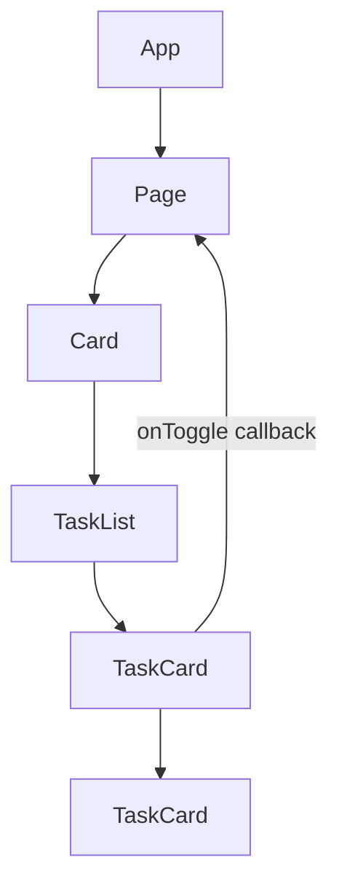

# JSX and Components

## What

JSX is a syntax extension that puts HTML-like markup inside JavaScript. Components are functions that return JSX; React composes them into a tree and syncs it to the DOM.

## Why It Matters

JSX makes the structure of your UI explicit in code — markup, logic, and types in one place, checked by TypeScript. Component composition (components inside components, children passed through props) is how React apps scale: small pieces, named well, assembled into pages.

## How It Works

### JSX Rules

```tsx
function Profile({ user }: { user: User }) {
  const isOnline = user.lastSeenAt > Date.now() - 60_000

  return (
    <div className="profile">
      
      <h2>{user.name}</h2>
      {isOnline && <span className="badge">online</span>}
      <a href={`/users/${user.id}`}>View profile</a>
    </div>
  )
}
```

- One root element per return (or a fragment `<>...</>`)
- `className`, not `class`; `htmlFor`, not `for` (JSX attributes map to DOM properties)
- `{}` embeds any expression: values, calls, ternaries
- JSX escapes values automatically — no injection by default

### Rendering Lists

```tsx
function TaskList({ tasks }: { tasks: Task[] }) {
  return (
    <ul>
      {tasks.map(task => (
        <li key={task.id}>{task.title}</li>
      ))}
    </ul>
  )
}
```

`key` is how React identifies items between renders — a stable `id` from your API, never the array index on mutable lists.

### Conditional Rendering

```tsx
{error ? <ErrorMessage error={error} /> : <TaskList tasks={tasks} />}
{isLoading && <Spinner />}
```

### Composition with `children`

```tsx
function Card({ title, children }: { title: string; children: React.ReactNode }) {
  return (
    <section className="card">
      <header><h3>{title}</h3></header>
      <div className="card-body">{children}</div>
    </section>
  )
}

// usage — content flows in from the parent
<Card title="Today">
  <TaskList tasks={todayTasks} />
</Card>
```

`children` is a prop like any other — the parent decides what fills the slot.

### Props Are Read-Only

```tsx
<TaskCard task={task} onToggle={(id) => toggle(id)} />
```

Data down, callbacks up. A component never mutates its props — it renders them and reports intent through callbacks.



## Common Mistakes

- **Index as `key` on reorderable lists.** Reordering reuses DOM nodes for different data — inputs keep stale values. Use stable ids.
- **Giant components.** A 200-line component doing layout, data, and logic fights you. Extract by responsibility.
- **Duplicating markup with copy-paste variants.** If two blocks differ by data, that is one component with props.
- **Business logic inside JSX.** Extract handlers and computations above the return — the template stays readable.
