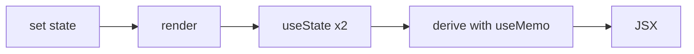

# State and Hooks

## What

`useState` gives a component memory — a value that survives re-renders and triggers them when changed. Hooks are the mechanism: functions that let function components use state, effects, and context.

## Why It Matters

React re-renders your component function constantly; plain local variables reset every time. `useState` is the sanctioned persistence, and its rules — call hooks unconditionally at the top level, update through the setter — are what keep re-renders predictable. Most React bugs trace back to fighting this model instead of using it.

## How It Works

### `useState`

```tsx
import { useState } from 'react'

function TaskFilter({ onFilter }: { onFilter: (p: Priority) => void }) {
  const [priority, setPriority] = useState<Priority>('all')

  return (
    <select
      value={priority}
      onChange={e => {
        setPriority(e.target.value as Priority)
        onFilter(e.target.value as Priority)
      }}
    >
      <option value="all">All</option>
      <option value="low">Low</option>
      <option value="high">High</option>
    </select>
  )
}
```

### Updates Are Replacements, Not Mutations

```tsx
const [task, setTask] = useState<Task>({ title: '', done: false })

// wrong — mutation is invisible to React
task.done = true

// right — new object, new render
setTask({ ...task, done: true })
```

State from arrays and objects requires new references:

```tsx
setTasks(prev => [...prev, newTask])
setTasks(prev => prev.filter(t => t.id !== id))
```

The updater form (`prev =>`) is mandatory when the next value depends on the current one.

### Batched Updates

Event handlers batch their state updates into one re-render. Multiple `set` calls in a handler apply together — do not read state mid-handler expecting intermediate renders.

### Lifting State Up

Two siblings need the same value → move the state to their closest common parent and pass it down:

```tsx
function TaskPage() {
  const [tasks, setTasks] = useState<Task[]>([])
  const [filter, setFilter] = useState<Priority>('all')

  const visible = useMemo(
    () => tasks.filter(t => filter === 'all' || t.priority === filter),
    [tasks, filter]
  )

  return (
    <>
      <TaskFilter priority={filter} onFilter={setFilter} />
      <TaskList tasks={visible} />
    </>
  )
}
```

Derived values (`visible`) are computed during render — not stored in state. `useMemo` caches expensive derivations keyed on dependencies.

### The Rules of Hooks

1. Only call hooks at the top level of a component or custom hook — never inside loops, conditions, or callbacks.
2. Only call them from React functions (components or custom hooks), not plain modules.

React relies on call order to pair hook state with the component; conditional calls break that pairing.



## Common Mistakes

- **Mirroring props into state.** `useState(props.value)` goes stale when the prop changes. Derive or key the component instead.
- **Storing derived state.** `doneCount` belongs in `useMemo` (or plain render), not a second `useState` synced by hand.
- **Mutating state objects.** React sees the same reference and skips the render. Always produce a new object/array.
- **Hooks behind `if` statements.** Order must be identical across every render — hoist conditionals inside the hook, not around it.
