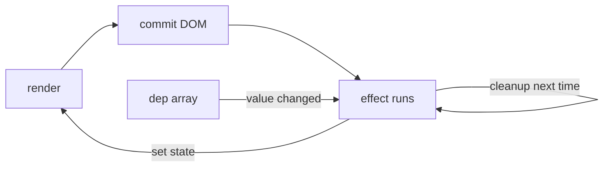

# Effects and Data Fetching

## What

`useEffect` runs side effects after render: syncing with external systems, subscribing to events, fetching data. It takes a function and a dependency array — the list of values that re-trigger it.

## Why It Matters

Effects are the escape hatch from React's render cycle to the outside world — and the most misused hook. Knowing when an effect is warranted (synchronization with externals) versus when it is a smell (deriving state, responding to user events) keeps components predictable. For API data specifically, raw `useEffect` fetching is already considered low-level — TanStack Query (next section) is the production pattern, built on these fundamentals.

## How It Works

### The Shape

```tsx
import { useEffect, useState } from 'react'

function useOnlineStatus() {
  const [online, setOnline] = useState(navigator.onLine)

  useEffect(() => {
    const on = () => setOnline(true)
    const off = () => setOnline(false)
    window.addEventListener('online', on)
    window.addEventListener('offline', off)

    return () => {                      // cleanup — runs before the next effect + on unmount
      window.removeEventListener('online', on)
      window.removeEventListener('offline', off)
    }
  }, [])                                // [] — subscribe once

  return online
}
```

Dependencies: `[]` runs once after mount; `[a, b]` re-runs when `a` or `b` changes; no array re-runs after every render (almost never what you want).

### The Classic: Fetching in an Effect

```tsx
function TaskList() {
  const [tasks, setTasks] = useState<Task[]>([])
  const [loading, setLoading] = useState(true)
  const [error, setError] = useState<string | null>(null)

  useEffect(() => {
    let cancelled = false                       // guard against races
    setLoading(true)

    api.tasks.list()
      .then(data => { if (!cancelled) setTasks(data.items) })
      .catch(err => { if (!cancelled) setError(err.message) })
      .finally(() => { if (!cancelled) setLoading(false) })

    return () => { cancelled = true }
  }, [])

  if (loading) return <Spinner />
  if (error) return <ErrorNote message={error} />
  return <ul>{tasks.map(t => <TaskRow key={t.id} task={t} />)}</ul>
}
```

Three states, a cancel guard for the fast-typing/route-change case, and cleanup. Every line of this becomes one line with TanStack Query — but you must be able to read this pattern, because it is what the library does for you.

### Effects Are for Synchronization

| Need | Use |
|------|-----|
| Subscribe to browser/websocket events | `useEffect` + cleanup |
| Fetch API data | TanStack Query (or typed fetch in an effect) |
| Respond to a click | Event handler — not an effect |
| Transform `a` into `b` | Render-time derivation / `useMemo` |
| Reset state when a prop changes | `key` the component |



## Common Mistakes

- **Missing cleanup.** Subscriptions, timers, and intervals leak and fire on dead components. Every subscribe needs its unsubscribe.
- **Missing dependency.** An effect reading `filter` but declaring `[]` serves stale data. List everything the effect reads (or use the ESLint exhaustive-deps rule).
- **Chained setState cascades.** One effect setting state that triggers another effect setting state — flatten into a single derivation or a handler.
- **Fetching without race protection.** Out-of-order responses overwrite fresh data. The `cancelled` flag (or an abort controller) is not optional.
