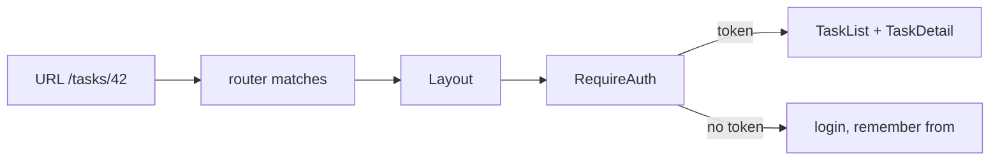

# React Router

## What

React Router maps URL to component tree: routes are declared as nested elements, `Link` navigates without reloads, and loaders/guards run logic before a route renders.

## Why It Matters

Routing is the skeleton of an SPA — deep links, back buttons, and protected pages all hang off it. Declarative, nested routes also solve layout: shared chrome (navbars, sidebars) lives in layout routes instead of being repeated per page. Auth-protected routes are where router meets your JWT backend, and the patterns here mirror NestJS guards on the other side of the wire.

## How It Works

### Declare Routes

```tsx
// main.tsx
import { createBrowserRouter, RouterProvider } from 'react-router-dom'
import { RequireAuth } from './auth/RequireAuth'

const router = createBrowserRouter([
  {
    path: '/',
    element: <Layout />,                       // shared chrome + <Outlet />
    children: [
      { index: true, element: <Dashboard /> },
      {
        path: 'tasks',
        element: <RequireAuth><TaskList /></RequireAuth>,
        children: [
          { path: ':taskId', element: <TaskDetail /> }
        ]
      },
      { path: 'login', element: <Login /> }
    ]
  },
  { path: '*', element: <NotFound /> }
])

createRoot(document.getElementById('root')!).render(
  <RouterProvider router={router} />
)
```

```tsx
// Layout.tsx
import { Outlet, NavLink } from 'react-router-dom'

export function Layout() {
  return (
    <div>
      <nav>
        <NavLink to="/">Dashboard</NavLink>
        <NavLink to="/tasks">Tasks</NavLink>
      </nav>
      <main><Outlet /></main>   {/* matched child renders here */}
    </div>
  )
}
```

Nested routes render into `<Outlet />` — layout composition without repetition.

### Navigate and Read Params

```tsx
import { Link, useNavigate, useParams, useSearchParams } from 'react-router-dom'

function TaskDetail() {
  const { taskId } = useParams()
  const [params] = useSearchParams()          // ?priority=high
  const navigate = useNavigate()

  return (
    <>
      <Link to="/tasks">Back</Link>
      <button onClick={() => navigate('/')}>Home</button>
      <p>Task {taskId} — filter {params.get('priority')}</p>
    </>
  )
}
```

### Protected Routes

```tsx
// auth/RequireAuth.tsx
import { Navigate, useLocation } from 'react-router-dom'
import { useAuth } from '../state/auth'

export function RequireAuth({ children }: { children: React.ReactNode }) {
  const token = useAuth(s => s.token)
  const location = useLocation()

  if (!token) {
    return <Navigate to="/login" state={{ from: location }} replace />
  }
  return <>{children}</>
}
```

The login page sends users back:

```tsx
const location = useLocation()
const from = (location.state as { from?: Location })?.from?.pathname ?? '/'
navigate(from, { replace: true })
```



## Common Mistakes

- **Auth checks that only hide links.** Hide UI with auth state, block rendering with `RequireAuth` — and remember the NestJS guard is the real enforcement.
- **No catch-all route.** `path: '*'` must exist, or unknown URLs render a blank page.
- **`<a href>` for internal navigation.** Full page reload, state lost. `<Link>`/`<NavLink>` for in-app moves.
- **Deploying an SPA without history fallback.** `/tasks/42` must serve `index.html` — configure nginx (`try_files`) or your host, or deep links 404.
