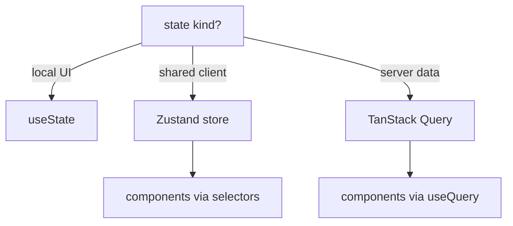

# State: Context and Zustand

## What

Context broadcasts a value to a subtree without prop-drilling. Zustand is a minimal store for shared client state outside the component tree. Server data is neither — it belongs to TanStack Query.

## Why It Matters

Three kinds of state have three homes. Local UI state lives in `useState`. Shared client state (session, theme) lives in a store. Server data (tasks, users) lives in a query cache with its own lifecycle. Misfiling them — stuffing server responses into Context, or lifting everything to a global store — creates stale-data bugs and re-render storms.

## How It Works

### Context — Injected Dependencies

```tsx
// theme/ThemeProvider.tsx
import { createContext, useContext, useState } from 'react'

const ThemeContext = createContext<{ dark: boolean; toggle: () => void } | null>(null)

export function ThemeProvider({ children }: { children: React.ReactNode }) {
  const [dark, setDark] = useState(false)
  return (
    <ThemeContext.Provider value={{ dark, toggle: () => setDark(d => !d) }}>
      {children}
    </ThemeContext.Provider>
  )
}

export function useTheme() {
  const ctx = useContext(ThemeContext)
  if (!ctx) throw new Error('useTheme must be used within ThemeProvider')
  return ctx
}
```

Every consumer re-renders when the context value changes — keep the value stable and small.

### Zustand — A Store in 10 Lines

```tsx
// state/auth.ts
import { create } from 'zustand'

interface AuthState {
  token: string | null
  user: User | null
  setSession: (token: string, user: User) => void
  logout: () => void
}

export const useAuth = create<AuthState>(set => ({
  token: localStorage.getItem('token'),
  user: null,
  setSession: (token, user) => {
    set({ token, user })
    localStorage.setItem('token', token)
  },
  logout: () => {
    set({ token: null, user: null })
    localStorage.removeItem('token')
  }
}))
```

Consume with selectors — only the component using `token` re-renders when it changes:

```tsx
function Nav() {
  const user = useAuth(s => s.user)
  const logout = useAuth(s => s.logout)
  return user ? <button onClick={logout}>{user.email}</button> : <LoginLink />
}
```

Plain stores work anywhere — components, router guards, axios interceptors:

```ts
// attach token to every request
api.interceptors.request.use(config => {
  const token = useAuth.getState().token
  if (token) config.headers.Authorization = `Bearer ${token}`
  return config
})
```

### Where Each State Lives

| State | Home |
|-------|------|
| Input value, modal open | `useState` |
| Theme, locale, session | Context or Zustand |
| Tasks from the API | TanStack Query cache |
| Cross-page client cache | Zustand |



## Common Mistakes

- **Server data in Zustand.** Fetching, caching, refetching, and invalidation are a solved problem — TanStack Query. Stores hold what the server does not know.
- **Context as a global variable.** Wide, frequently-changing context values re-render entire subtrees. Scope contexts narrowly.
- **One mega-store.** Split by domain (`auth`, `ui`) — stores are cheap.
- **Selecting the whole store.** `useAuth()` without a selector re-renders on any change. Select the slice.
