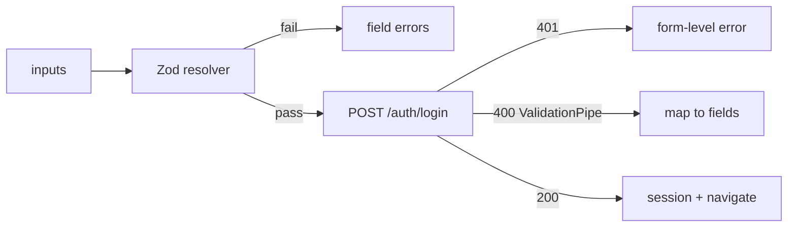

# Forms and Validation

## What

React forms are controlled inputs — value in state, changes through handlers — validated client-side (react-hook-form + Zod) and re-validated server-side (NestJS Validation Pipe). Submission is a mutation with explicit idle/loading/error states.

## Why It Matters

Forms convert user intent into API calls, and bad forms convert it into 400 errors and lost input. The discipline is: validate early with the same rules the server enforces, disable submission while in flight, and map server errors back to fields. React Hook Form + Zod gives you uncontrolled inputs with typed schemas — and the Zod schema mirrors the NestJS DTO, one contract on both sides.

## How It Works

### React Hook Form + Zod

```tsx
// features/auth/LoginForm.tsx
import { useForm } from 'react-hook-form'
import { zodResolver } from '@hookform/resolvers/zod'
import { z } from 'zod'

const LoginSchema = z.object({
  email: z.string().email('Enter a valid email'),
  password: z.string().min(8, 'At least 8 characters')
})
type LoginInput = z.infer<typeof LoginSchema>

export function LoginForm() {
  const {
    register,
    handleSubmit,
    formState: { errors, isSubmitting }
  } = useForm<LoginInput>({
    resolver: zodResolver(LoginSchema),
    defaultValues: { email: '', password: '' }
  })

  const onSubmit = async (data: LoginInput) => {
    try {
      await api.post('/auth/login', data)
    } catch (err) {
      // server rejected — surface it
      setServerError('Invalid credentials')
    }
  }

  return (
    <form onSubmit={handleSubmit(onSubmit)} noValidate>
      <input {...register('email')} type="email" placeholder="Email" />
      {errors.email && <p className="error">{errors.email.message}</p>}

      <input {...register('password')} type="password" placeholder="Password" />
      {errors.password && <p className="error">{errors.password.message}</p>}

      <button disabled={isSubmitting}>
        {isSubmitting ? 'Signing in…' : 'Sign in'}
      </button>
    </form>
  )
}
```

`register` wires the input; the resolver runs the Zod schema; `isSubmitting` disables the button during flight.

### The Schema Mirrors the DTO

```ts
// NestJS — server truth
export class LoginDto {
  @IsEmail() email: string
  @MinLength(8) password: string
}

// Zod — client mirror
const LoginSchema = z.object({
  email: z.string().email(),
  password: z.string().min(8)
})
```

Same rules, both layers. Client validation is UX; the Validation Pipe is enforcement.

### Server Errors Back to Fields

```tsx
const res = await api.post('/tasks', payload).catch(e => e.response)
if (res?.status === 400 && res.data.message?.length) {
  for (const msg of res.data.message as string[]) {
    // NestJS ValidationPipe returns message[] — parse and setError as needed
  }
}
```



## Common Mistakes

- **Validating with conditionals scattered in the handler.** The schema is the rules; handlers stay declarative.
- **No `noValidate`.** Browser-native validation messages bypass your Zod errors and look foreign.
- **Letting double submits through.** `disabled={isSubmitting}` is the minimum; also guard the mutation.
- **Client-only rules.** If the server accepts 1-char passwords, the client pretending otherwise is a lie. Keep DTO and schema aligned.
- **Clearing all errors on any keystroke.** Clear the field being edited; keep the rest.
