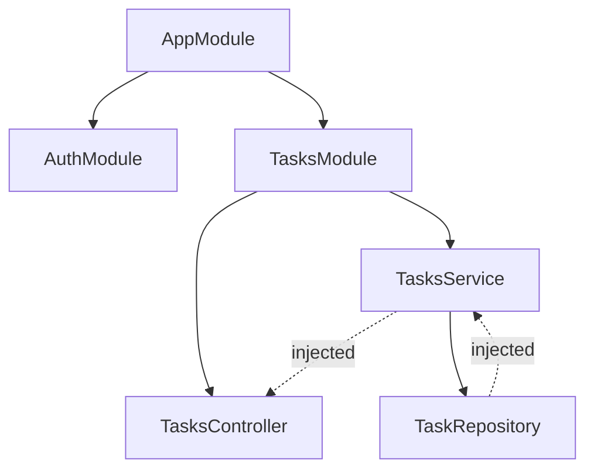

# NestJS Architecture and Dependency Injection

## What

NestJS organizes a backend into modules — each a `@Module()` class grouping related controllers and providers. Dependencies (services, repositories) are injected through the constructor by the framework's IoC container, not created by hand.

## Why It Matters

Unstructured Express apps rot into a pile of routes importing each other's helpers. NestJS imposes the structure production apps converge on anyway: modules as boundaries, services as logic, injected dependencies instead of singletons. The same architecture you know from Spring (Angular lineage is deliberate) — controllers/services/repositories, constructor injection, lifecycle hooks — which makes it a natural backend for React frontends and a résumé that transfers.

## How It Works

### Module Anatomy

```ts
// tasks/tasks.module.ts
import { Module } from '@nestjs/common'
import { TasksController } from './tasks.controller'
import { TasksService } from './tasks.service'

@Module({
  controllers: [TasksController],
  providers: [TasksService],
  exports: [TasksService]        // other modules may import it
})
export class TasksModule {}
```

```ts
// app.module.ts — the root that composes everything
@Module({
  imports: [AuthModule, TasksModule, MongooseModule.forRoot(...)]
})
export class AppModule {}
```

### Constructor Injection

```ts
// tasks/tasks.service.ts
import { Injectable } from '@nestjs/common'

@Injectable()
export class TasksService {
  constructor(private readonly repo: TaskRepository) {}

  listForUser(userId: string) {
    return this.repo.listForUser(userId)
  }
}
```

The `@Injectable()` decorator registers the class with the module's container. When Nest instantiates `TasksController`, it sees `TasksService` in the constructor, resolves (or creates) it, and passes it in. You never `new TasksService()`.

### What the Container Buys You

| Without DI | With DI |
|------------|---------|
| `new TaskRepository()` in every file | One instance, injected where declared |
| Swap implementation = edit N call sites | Swap the provider token, done |
| Tests need real dependencies | Override with a fake in `Test.createTestingModule` |

### Testing With Overridden Providers

```ts
const moduleRef = await Test.createTestingModule({
  controllers: [TasksController],
  providers: [
    TasksService,
    { provide: TaskRepository, useValue: fakeRepo }
  ]
}).compile()
```

The controller under test never knows the difference.



### Feature-Module Boundaries

Group by domain (`tasks/`, `users/`, `auth/`), each owning its controller, service, DTOs, and schema. Cross-module use goes through `imports` + `exports` — explicit dependencies between modules, no import cycles.

## Common Mistakes

- **One `AppModule` with 15 controllers.** The module graph is the architecture — use it.
- **Instantiating services manually.** `new TasksService(new Repo())` bypasses the container, duplicates state, and blocks test overrides.
- **Importing across module internals.** Reaching into `TasksModule`'s private providers from `AuthModule` couples boundaries. Export what is public; import the module.
- **God services.** A service doing auth + email + tasks is three services. Constructor lists that tell you a class's dependencies are the point.
