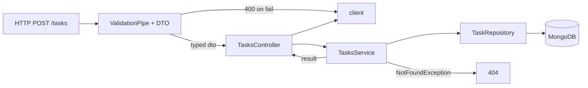

# Controllers and Providers

## What

Controllers map HTTP to handlers — `@Get()`, `@Post()` decorators on a class routed by `@Controller('tasks')`. Providers are anything the container injects; services are the providers that hold business logic. DTOs define the typed shape of requests.

## Why It Matters

This trio is the daily surface of NestJS development: a route, a typed contract, and the logic between. Controllers stay thin (parse, delegate, shape the response), services stay testable (no HTTP anywhere), and DTOs carry validation metadata that the Validation Pipe enforces. Get the split right and every feature lands in the same three files.

## How It Works

### Controller

```ts
// tasks/tasks.controller.ts
import { Body, Controller, Delete, Get, Param, ParseUUIDPipe, Post, UseGuards } from '@nestjs/common'

@Controller('tasks')
export class TasksController {
  constructor(private readonly tasks: TasksService) {}

  @Get()
  list(@CurrentUser() user: UserPayload) {
    return this.tasks.listForUser(user.id)
  }

  @Post()
  create(
    @Body() dto: CreateTaskDto,
    @CurrentUser() user: UserPayload
  ) {
    return this.tasks.create(user.id, dto)
  }

  @Delete(':id')
  remove(
    @Param('id', ParseUUIDPipe) id: string,
    @CurrentUser() user: UserPayload
  ) {
    return this.tasks.remove(id, user.id)
  }
}
```

Decorators pull typed values from the request — body, params, query, headers — and custom decorators (`@CurrentUser()`) compose the same way.

### DTOs — The Request Contract

```ts
// tasks/dto/create-task.dto.ts
import { IsIn, IsOptional, IsString, MaxLength, MinLength } from 'class-validator'

export class CreateTaskDto {
  @IsString()
  @MinLength(1)
  @MaxLength(200)
  title: string

  @IsIn(['low', 'high'])
  priority: 'low' | 'high'

  @IsOptional()
  @IsDateString()
  dueDate?: string
}
```

With the global `ValidationPipe({ whitelist: true })`, invalid or unknown fields never reach the handler — they bounce as a 400 with per-field messages.

### Service — The Logic

```ts
// tasks/tasks.service.ts
@Injectable()
export class TasksService {
  constructor(private readonly repo: TaskRepository) {}

  async remove(id: string, userId: string) {
    const deleted = await this.repo.removeForUser(id, userId)
    if (!deleted) throw new NotFoundException('Task not found')
    return { deleted: true }
  }

  create(userId: string, dto: CreateTaskDto) {
    return this.repo.create({ ...dto, userId })
  }
}
```

Services throw HTTP-mapped exceptions (`NotFoundException`) without touching request objects.

### Status Codes

```ts
@Post()
@HttpCode(201)
create(...) {}
```

Or return 201 by default for `@Post` and 200 otherwise — override when the semantics differ.



## Common Mistakes

- **Business logic in controllers.** Controllers parse and delegate; anything worth testing lives in a service.
- **Skipping DTOs and trusting `any`.** Without DTOs the Validation Pipe has nothing to enforce — the API accepts whatever arrives.
- **Unscoped queries in services.** Every task operation takes `userId` and filters by it — ownership enforced in one place, impossible to forget per-route.
- **Returning entities with secrets.** Map to response shapes (`class-transformer`'s `@Exclude()`, or explicit response DTOs) before sending.
