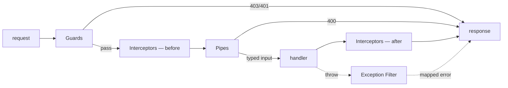

# Pipes, Guards, and Interceptors

## What

NestJS routes requests through a component pipeline: guards decide *if* the handler runs (auth), pipes transform and validate *input* (DTOs, params), interceptors wrap *execution* (logging, mapping), and exception filters catch what failed.

## Why It Matters

Cross-cutting concerns belong in the pipeline, not copy-pasted into handlers. "Is this request authenticated?" once, in a guard. "Is this body valid?" once, in a pipe. "Log every mutation" once, in an interceptor. This is the middleware idea with types, DI, and scopes (route, controller, or global) — and it composes with your React guards on the other end.

## How It Works

### Guard — Should This Run at All?

```ts
// auth/jwt-auth.guard.ts
import { CanActivate, ExecutionContext, Injectable } from '@nestjs/common'

@Injectable()
export class JwtAuthGuard implements CanActivate {
  canActivate(context: ExecutionContext): boolean {
    const req = context.switchToHttp().getRequest()
    const token = req.headers.authorization?.replace('Bearer ', '')
    if (!token) throw new UnauthorizedException()

    try {
      req.user = verifyToken(token)          // { id, email }
      return true
    } catch {
      throw new UnauthorizedException('Invalid or expired token')
    }
  }
}
```

Apply per-route, per-controller, or globally:

```ts
@Controller('tasks')
@UseGuards(JwtAuthGuard)          // every route below requires a token
export class TasksController {}
```

### Pipe — Validate and Transform Input

```ts
// main.ts — the pipe you already use
app.useGlobalPipes(new ValidationPipe({
  whitelist: true,       // strip unknown fields
  forbidNonWhitelisted: true,   // or reject them with 400
  transform: true        // payloads become DTO class instances
}))
```

Param pipes work inline:

```ts
@Get(':id')
getOne(@Param('id', ParseUUIDPipe) id: string) {}   // 400 if not a UUID
```

### Interceptor — Around the Handler

```ts
// common/logging.interceptor.ts
import { CallHandler, ExecutionContext, Injectable, NestInterceptor } from '@nestjs/common'
import { tap } from 'rxjs/operators'

@Injectable()
export class LoggingInterceptor implements NestInterceptor {
  intercept(context: ExecutionContext, next: CallHandler) {
    const req = context.switchToHttp().getRequest()
    const start = Date.now()

    return next.handle().pipe(
      tap(() => console.log(`${req.method} ${req.url} — ${Date.now() - start}ms`))
    )
  }
}
```

Interceptors also transform responses — `map(data => ({ data, meta: { count } }))` — and cache results, because they wrap the handler's observable.

### Exception Filter — One Error Shape

```ts
// common/http-exception.filter.ts
@Catch()
export class AllExceptionsFilter implements ExceptionFilter {
  catch(exception: unknown, host: ArgumentsHost) {
    const res = host.switchToHttp().getResponse()

    if (exception instanceof HttpException) {
      const status = exception.getStatus()
      const body = exception.getResponse()
      return res.status(status).json({ error: { code: status, message: body?.message ?? body } })
    }

    console.error(exception)
    return res.status(500).json({ error: { code: 500, message: 'Internal error' } })
  }
}
```

### The Pipeline Order



## Common Mistakes

- **Auth checks inside handlers.** An `if (!req.user)` in a handler is one forgotten copy away from a leak. Guards are the only enforcement; the frontend `RequireAuth` is UX.
- **Validating with `typeof` in handlers.** That is what DTOs + the Validation Pipe do — declaratively, with better errors.
- **Doing heavy work in interceptors.** They wrap execution; logging and mapping, not business logic.
- **`forbidNonWhitelisted` without `whitelist`.** Strip or reject unknown fields — silently accepting them invites mass-assignment bugs.
