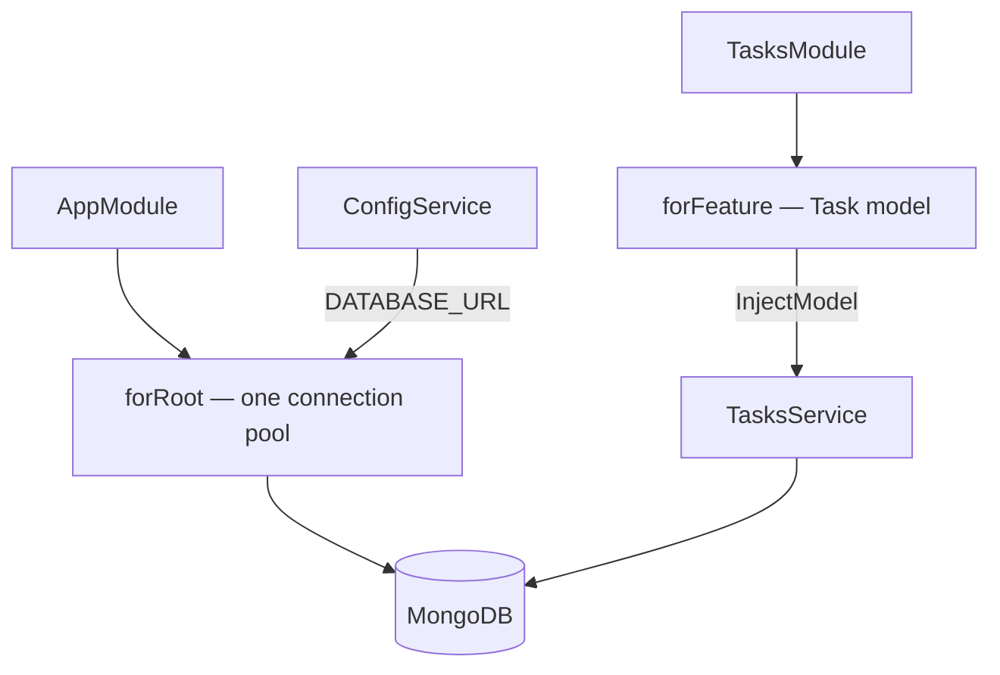

# NestJS + Mongoose Module

## What

`@nestjs/mongoose` integrates MongoDB into the module system: `MongooseModule.forRoot()` opens the app-wide connection, and `MongooseModule.forFeature()` registers schemas per feature module, making typed models injectable.

## Why It Matters

The connection is infrastructure; the schemas belong to features. Nest's integration keeps both where they belong — one connection created at bootstrap from environment config, models declared next to the tasks module that uses them, injected like any provider. No globals, no `require('./db')` from route files, and tests can swap `forFeature` for fakes.

## How It Works

### Root Connection

```ts
// app.module.ts
import { Module } from '@nestjs/common'
import { MongooseModule } from '@nestjs/mongoose'
import { ConfigModule, ConfigService } from '@nestjs/config'

@Module({
  imports: [
    ConfigModule.forRoot({ isGlobal: true }),   // loads .env
    MongooseModule.forRootAsync({
      inject: [ConfigService],
      useFactory: (config: ConfigService) => ({
        uri: config.getOrThrow<string>('DATABASE_URL')   // fail fast if missing
      })
    }),
    TasksModule,
    AuthModule
  ]
})
export class AppModule {}
```

`getOrThrow` crashes at startup on a missing variable — exactly when you want to learn about it.

### Feature Registration

```ts
// tasks/tasks.module.ts
import { MongooseModule } from '@nestjs/mongoose'
import { Task, TaskSchema } from './schemas/task.schema'

@Module({
  imports: [MongooseModule.forFeature([
    { name: Task.name, schema: TaskSchema }
  ])],
  controllers: [TasksController],
  providers: [TasksService]
})
export class TasksModule {}
```

### Inject the Model

```ts
// tasks/tasks.service.ts
import { InjectModel } from '@nestjs/mongoose'
import { Model } from 'mongoose'

@Injectable()
export class TasksService {
  constructor(@InjectModel(Task.name) private readonly taskModel: Model<Task>) {}

  listForUser(userId: string) {
    return this.taskModel.find({ user: userId }).sort({ createdAt: -1 }).lean().exec()
  }
}
```

The decorated constructor parameter is an ordinary injected provider — mockable in tests like any other.

### Local Database

```yaml
# docker-compose.yml
services:
  mongo:
    image: mongo:7
    ports: ["27017:27017"]
    volumes: [mongo-data:/data/db]
volumes:
  mongo-data:
```

```bash
docker compose up -d
DATABASE_URL=mongodb://localhost:27017/taskapp bun run start:dev
```



## Common Mistakes

- **`forRoot` inside a feature module.** The connection is app-level — `AppModule` only. Feature modules use `forFeature`.
- **Hardcoded connection strings.** URI through `ConfigService`, value in `.env`, committed file is `.env.example`.
- **Instantiating models via `new Task()` imports.** Bypassing DI works until tests. Always `@InjectModel`.
- **One `forFeature` in a shared module for everything.** Register schemas in the module that owns the domain — boundaries stay real.
