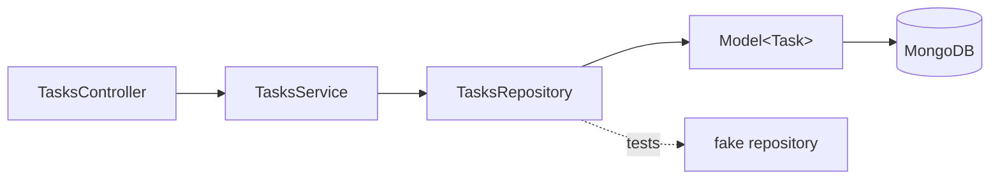

# Schemas and Repositories

## What

A Mongoose schema in NestJS is a class decorated with `@Schema()`, fields decorated with `@Prop()` — compiled into a typed model. A repository wraps a model behind use-case methods, so services never write Mongoose queries themselves.

## Why It Matters

Schemas put your data-modeling decisions (embed vs reference, indexes, validation) into typed, decorated classes. Repositories concentrate persistence: scoping rules (every query filtered by owner) get written once, Mongoose details stop leaking into services, and tests replace one injectable class instead of mocking a database.

## How It Works

### The Schema

```ts
// tasks/schemas/task.schema.ts
import { Prop, Schema, SchemaFactory } from '@nestjs/mongoose'
import { HydratedDocument, Types } from 'mongoose'

@Schema({ timestamps: true })
export class Task {
  @Prop({ required: true, trim: true, maxlength: 200 })
  title: string

  @Prop({ required: true, enum: ['low', 'high'], default: 'low' })
  priority: 'low' | 'high'

  @Prop({ default: false })
  completed: boolean

  @Prop({ type: Date })
  dueDate?: Date

  @Prop({ type: Types.ObjectId, ref: 'User', required: true, index: true })
  user: Types.ObjectId
}

export type TaskDocument = HydratedDocument<Task>
export const TaskSchema = SchemaFactory.createForClass(Task)
```

Register it in the module (`forFeature([{ name: Task.name, schema: TaskSchema }])`) — done.

### The Repository

```ts
// tasks/tasks.repository.ts
import { Injectable } from '@nestjs/common'
import { InjectModel } from '@nestjs/mongoose'
import { Model } from 'mongoose'
import { Task, TaskDocument } from './schemas/task.schema'
import { CreateTaskDto } from './dto/create-task.dto'

@Injectable()
export class TasksRepository {
  constructor(@InjectModel(Task.name) private readonly model: Model<TaskDocument>) {}

  listForUser(userId: string, priority?: 'low' | 'high') {
    const filter: Record<string, unknown> = { user: userId }
    if (priority) filter.priority = priority
    return this.model.find(filter).sort({ createdAt: -1 }).lean().exec()
  }

  findByIdForUser(id: string, userId: string) {
    return this.model.findOne({ _id: id, user: userId }).lean().exec()
  }

  create(userId: string, dto: CreateTaskDto) {
    return this.model.create({ ...dto, user: userId })
  }

  async removeForUser(id: string, userId: string) {
    const res = await this.model.deleteOne({ _id: id, user: userId }).exec()
    return res.deletedCount === 1
  }
}
```

Ownership scoping is structural — there is no repository method that can forget the `user` filter.

### Service Uses Use-Case Language

```ts
// tasks/tasks.service.ts
@Injectable()
export class TasksService {
  constructor(private readonly repo: TasksRepository) {}

  async remove(id: string, userId: string) {
    const removed = await this.repo.removeForUser(id, userId)
    if (!removed) throw new NotFoundException('Task not found')
    return { deleted: true }
  }
}
```

Register the repository in `providers` alongside the service.

### Testing the Swap

```ts
const moduleRef = await Test.createTestingModule({
  controllers: [TasksController],
  providers: [
    TasksService,
    { provide: TasksRepository, useValue: fakeTasksRepository }
  ]
}).compile()
```



## Common Mistakes

- **Pass-through repositories.** `find(filter: any)` re-exports Mongoose. Methods express use cases with baked-in scoping.
- **Queries in services.** Every `taskModel.find` in a service is a missed boundary — swap them for repository calls.
- **Missing `.lean()` on read paths.** Documents carry Mongoose overhead; reads that skip hydration are cheaper.
- **Omitting `@Prop()` options you rely on.** `required`, `enum`, and `index` are the schema doing real work — decorative `@Prop()` fields default to optional and unindexed.
