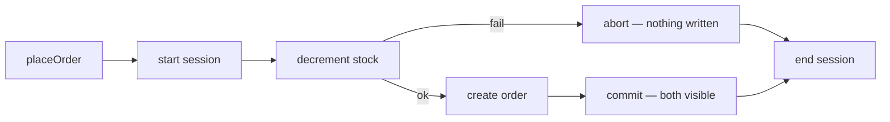

# Population and Transactions

## What

Population resolves stored references into documents — Mongoose's join. Transactions run multiple writes as one all-or-nothing unit across collections, coordinated by a replica set session.

## Why It Matters

References are only half the data model — reading "task with its owner's name" needs population, and doing it badly means N+1 queries. On the write side, operations spanning documents (debit one account, credit another; create order, decrement stock) must either succeed together or not at all — that is a transaction. These two tools turn a usable data model into a correct one.

## How It Works

### Populate — Resolve a Reference

```ts
// in the repository
findByIdPopulated(id: string) {
  return this.model
    .findById(id)
    .populate('user', 'email name')     // only the fields you need
    .lean()
    .exec()
}
```

The stored `user` ObjectId becomes `{ email, name }` in the result. Always project — populating whole user documents leaks `passwordHash`.

### N+1 and How to Kill It

```ts
// BAD — one query per task
const tasks = await model.find({ user: userId })
const withUsers = await Promise.all(
  tasks.map(t => t.populate('user', 'name'))
)

// GOOD — one query
const withUsers = await model
  .find({ user: userId })
  .populate('user', 'name')
```

Populate in the query, not per-document. If a list endpoint does not need related data, skip populate entirely — that is the document model paying off.

### Transactions — All or Nothing

```ts
import { InjectConnection } from '@nestjs/mongoose'
import { Connection } from 'mongoose'

@Injectable()
export class OrdersService {
  constructor(
    @InjectConnection() private readonly connection: Connection,
    private readonly orders: OrdersRepository,
    private readonly inventory: InventoryRepository
  ) {}

  async placeOrder(userId: string, dto: CreateOrderDto) {
    const session = await this.connection.startSession()

    try {
      let order: OrderDocument | null = null

      await session.withTransaction(async () => {
        const stock = await this.inventory.decrement(dto.sku, dto.qty, { session })
        if (!stock) throw new ConflictException('Insufficient stock')

        order = await this.orders.create(userId, dto, { session })
      })

      return order
    } finally {
      await session.endSession()
    }
  }
}
```

Every write inside the transaction receives `{ session }`. Any throw aborts everything; `withTransaction` retries on transient errors.

### The Local Caveat

Transactions need a replica set. For local development, run one via Compose:

```yaml
services:
  mongo:
    image: mongo:7
    command: ["--replSet", "rs0", "--bind_ip_all"]
    ports: ["27017:27017"]
    healthcheck:
      test: mongosh --eval "try { rs.status().ok } catch (e) { rs.initiate().ok }"
      interval: 5s
```



## Common Mistakes

- **Populating everything by default.** Populate is a per-query decision — lists usually need less detail than detail views.
- **Populating without a projection.** `.populate('user')` returns the full user document, secrets included. Name your fields.
- **Multi-step writes without a transaction.** Two `await`s in a row can half-apply on crash. If they must agree, they belong in one session.
- **Sessions missing on some operations.** A write inside the callback without `{ session }` runs outside the transaction — silently.
- **Transactions as default.** Single-document writes are already atomic in MongoDB. Use transactions for genuine multi-document invariants, not for style.
