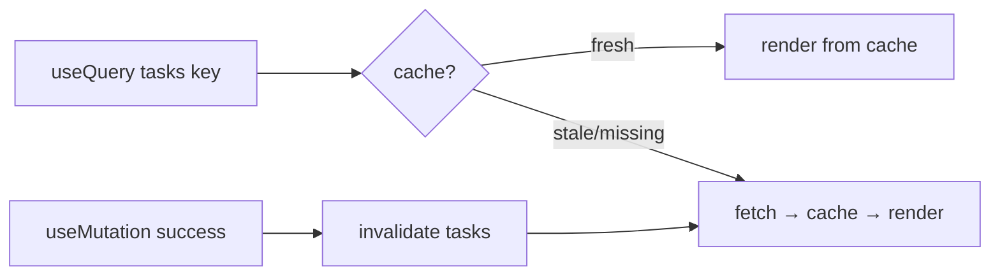

# TanStack Query Client

## What

TanStack Query manages server state on the client: `useQuery` reads, `useMutation` writes, and the library handles caching, background refetching, loading/error states, and invalidation after writes.

## Why It Matters

Server data is not client state — it is a cache of something that lives in your database. Hand-rolled fetching (state + effect + loading + error, per component) re-implements caching badly and drifts. TanStack Query gives every component declarative access to the same cache: two components asking for `['tasks']` share one request; a mutation invalidates that key and every view updates. It is the standard data layer for React in 2026.

## How It Works

### Setup — One Client, One Wrapper

```tsx
// lib/queryClient.ts
import { QueryClient } from '@tanstack/react-query'

export const queryClient = new QueryClient({
  defaultOptions: { queries: { staleTime: 30_000, retry: 1 } }
})
```

```tsx
// lib/api.ts — typed fetch wrapper
export async function api<T>(path: string, init?: RequestInit): Promise<T> {
  const res = await fetch(`${import.meta.env.VITE_API_URL}${path}`, {
    ...init,
    headers: {
      'Content-Type': 'application/json',
      Authorization: `Bearer ${useAuth.getState().token ?? ''}`,
      ...init?.headers
    }
  })
  if (!res.ok) throw new ApiError(res.status, await res.json())
  return res.json()
}
```

```tsx
// main.tsx
<QueryClientProvider client={queryClient}>
  <RouterProvider router={router} />
</QueryClientProvider>
```

### Reading — `useQuery`

```tsx
// features/tasks/api.ts
export const fetchTasks = (priority?: string) =>
  api<{ items: Task[]; total: number }>(
    `/tasks${priority ? `?priority=${priority}` : ''}`
  )

export const taskKeys = {
  all: ['tasks'] as const,
  list: (priority?: string) => [...taskKeys.all, 'list', priority] as const
}
```

```tsx
// features/tasks/TaskList.tsx
const { data, isPending, isError, error } = useQuery({
  queryKey: taskKeys.list(priority),
  queryFn: () => fetchTasks(priority)
})

if (isPending) return <Spinner />
if (isError) return <ErrorNote message={error.message} />
return <ul>{data.items.map(t => <TaskRow key={t.id} task={t} />)}</ul>
```

The query key is the cache identity — change the key, get fresh data for that shape.

### Writing — `useMutation` + Invalidation

```tsx
const queryClient = useQueryClient()

const createTask = useMutation({
  mutationFn: (input: CreateTaskInput) =>
    api<Task>('/tasks', { method: 'POST', body: JSON.stringify(input) }),
  onSuccess: () => {
    queryClient.invalidateQueries({ queryKey: taskKeys.all })   // refetch lists
  }
})

// submit
createTask.mutate({ title, priority })
```

After a successful write, everything under `['tasks']` refetches — no manual state juggling.

### What You Stop Writing

| Hand-rolled | TanStack Query |
|-------------|----------------|
| `loading`/`error` state per component | `isPending`, `isError` from the hook |
| Effect + cancel guard | Query cache with dedup |
| Refetch after mutation, by hand | `invalidateQueries` |
| Window-focus staleness | `refetchOnWindowFocus` (default on) |



## Common Mistakes

- **Putting query results into local state.** `setTasks(data)` re-creates the staleness you just escaped — render from `data` directly.
- **Wrong key granularity.** `['tasks']` for every filtered list caches them as one entry. Key by inputs: `['tasks', 'list', priority]`.
- **Forgetting invalidation.** A mutation that succeeds without invalidating leaves every list showing pre-write data.
- **Re-fetching on every mount by fear.** Set `staleTime`; the defaults refetch aggressively. Cache settings are the point of the library.
