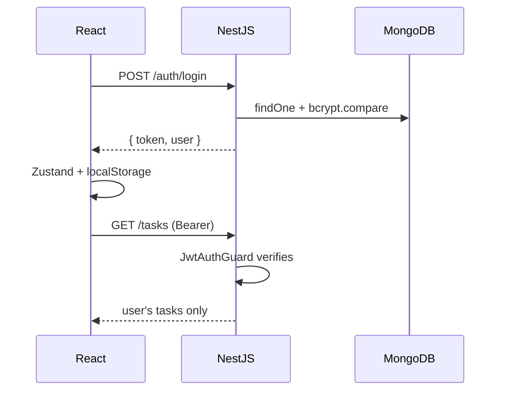

# Auth Flow with JWT and Guards

## What

Full JWT auth connects a NestJS issuer (login route signs tokens, `JwtAuthGuard` verifies them) with a React consumer (Zustand session, token on every request, `RequireAuth` route protection).

## Why It Matters

Auth is where frontend and backend discipline meet: hashed passwords, signed short-lived tokens, server-side enforcement on every protected route, and a client that stores the token safely and redirects gracefully. After this loop works, per-user data and role checks are plumbing — and it is the pattern production apps are audited on.

## How It Works

### Server: Issue

```ts
// auth/auth.service.ts
import * as bcrypt from 'bcrypt'
import { JwtService } from '@nestjs/jwt'

@Injectable()
export class AuthService {
  constructor(
    @InjectModel(User.name) private readonly users: Model<UserDocument>,
    private readonly jwt: JwtService
  ) {}

  async login(dto: LoginDto) {
    const user = await this.users.findOne({ email: dto.email })
    const valid = user && await bcrypt.compare(dto.password, user.passwordHash)
    if (!valid) throw new UnauthorizedException('Invalid credentials')

    return {
      token: this.jwt.sign({ sub: user.id, email: user.email }),   // 1h default
      user: { id: user.id, email: user.email, name: user.name }
    }
  }

  async signup(dto: SignupDto) {
    const exists = await this.users.findOne({ email: dto.email })
    if (exists) throw new ConflictException('Email already registered')

    const user = await this.users.create({
      email: dto.email,
      name: dto.name,
      passwordHash: await bcrypt.hash(dto.password, 10)
    })
    return this.login(dto)
  }
}
```

### Server: Verify — Strategy + Guard

```ts
// auth/jwt.strategy.ts
import { PassportStrategy } from '@nestjs/passport'
import { ExtractJwt, Strategy } from 'passport-jwt'
import { ConfigService } from '@nestjs/config'

@Injectable()
export class JwtStrategy extends PassportStrategy(Strategy) {
  constructor(config: ConfigService) {
    super({
      jwtFromRequest: ExtractJwt.fromAuthHeaderAsBearerToken(),
      secretOrKey: config.getOrThrow<string>('JWT_SECRET')
    })
  }

  validate(payload: { sub: string; email: string }) {
    return { id: payload.sub, email: payload.email }   // becomes req.user
  }
}
```

```ts
// auth/jwt-auth.guard.ts — passport strategy as a guard
@Injectable()
export class JwtAuthGuard extends AuthGuard('jwt') {}

// apply
@Controller('tasks')
@UseGuards(JwtAuthGuard)
export class TasksController {}
```

Every protected route now has `req.user` — controllers and services scope by `user.id`.

### Client: Session + Redirects

```ts
// state/auth.ts (Zustand)
export const useAuth = create<AuthState>((set) => ({
  token: localStorage.getItem('token'),
  user: null,
  setSession: (token, user) => {
    set({ token, user })
    localStorage.setItem('token', token)
  },
  logout: () => {
    set({ token: null, user: null })
    localStorage.removeItem('token')
  }
}))
```

The `api` wrapper (previous section) attaches `Authorization: Bearer <token>` automatically. On a 401 response, call `logout()` and redirect to `/login`. `RequireAuth` guards routes; the login form navigates back via the remembered `from` location.



## Common Mistakes

- **Storing plaintext passwords.** `bcrypt.hash` on write, `bcrypt.compare` on read — never reversible storage.
- **Default JWT secrets.** `secretOrKey: 'secret'` ships to production. `getOrThrow` at startup.
- **Trusting the client for authorization.** Guards on the server; `RequireAuth` only improves UX. Role checks (`RolesGuard`) belong server-side too.
- **Fat tokens.** Keep claims to `sub` and expiry — the payload is readable by anyone with the token.
- **No 401 handling on the client.** An expired token should log the user out and redirect, not leave every request failing silently.
