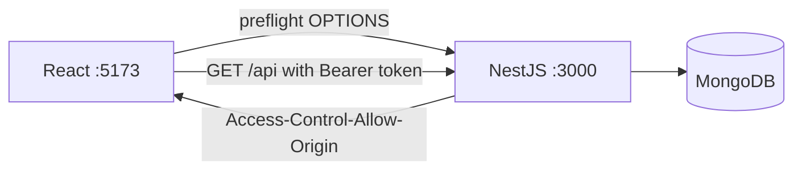

# CORS and Environment Config

## What

CORS lets a browser app on one origin call an API on another — in NestJS via `app.enableCors()`. Environment configuration routes per-environment values through `@nestjs/config`'s `ConfigService` instead of `process.env` scattered through code.

## Why It Matters

In development, Vite serves the React app on `:5173` and NestJS listens on `:3000` — different origins, so without CORS the browser blocks every call with an opaque network error. In production, origins and secrets differ again. Centralizing config makes missing values fail at boot (not mid-request) and keeps secrets out of the bundle and the repo.

## How It Works

### Enable CORS in NestJS

```ts
// main.ts
const app = await NestFactory.create(AppModule)

app.enableCors({
  origin: [/^http:\/\/localhost:\d+$/],     // dev origins (Vite)
  // origin: 'https://app.example.com',     // production
  credentials: true
})
```

List real origins. `origin: true` (reflect any) is fine for local play and wrong for production.

### The Vite Proxy Alternative

```ts
// frontend/vite.config.ts
export default defineConfig({
  server: {
    proxy: {
      '/api': {
        target: 'http://localhost:3000',
        rewrite: path => path.replace(/^\/api/, '')
      }
    }
  }
})
```

The browser only sees same-origin `/api/...` requests — CORS never fires in development. The same trick in production (nginx proxying `/api`) removes CORS from the deployed app entirely.

### Server Config — Validated at Boot

```bash
# server/.env
PORT=3000
DATABASE_URL=mongodb://localhost:27017/taskapp
JWT_SECRET=dev-secret-change-me
CORS_ORIGIN=http://localhost:5173
```

```ts
// app.module.ts
@Module({
  imports: [
    ConfigModule.forRoot({ isGlobal: true, envFilePath: '.env' }),
    // ...
  ]
})
```

```ts
// usage — typed, validated
const dbUrl = configService.getOrThrow<string>('DATABASE_URL')
const port = configService.get<number>('PORT') ?? 3000
```

### Frontend Config

```bash
# frontend/.env
VITE_API_URL=http://localhost:3000
```

```ts
// lib/api.ts
const BASE = import.meta.env.VITE_API_URL ?? ''
// with the Vite proxy, BASE is '' — same-origin /api
```

Rules: Bun and Vite load `.env` natively; only `VITE_*` variables exist in the browser bundle (anything else is server-only — which is the point); commit `.env.example` with keys and no values.



## Common Mistakes

- **Allow-all origins with credentials in production.** Enumerate the real frontend origin.
- **`process.env.X` sprinkled through services.** One `ConfigService` (with `getOrThrow`) — validated at boot, mockable in tests.
- **Reading `process.env` in the frontend.** It does not exist — `import.meta.env`, and only `VITE_*` variables.
- **Committing `.env`.** The example file is the contract; real values live on the host or in a secrets manager.
