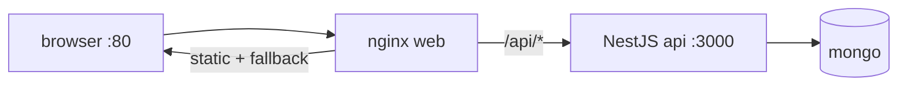

# Deployment with Docker

## What

Production deployment is two images — React static files behind nginx, NestJS as a Bun/Node runtime — plus MongoDB, defined by per-app Dockerfiles and one root Compose file.

## Why It Matters

Docker freezes the environment: the same Bun and dependency versions, same build steps, same env-var contract on your laptop, in CI, and on the host. Multi-stage builds keep images small; Compose expresses the whole system (web, api, mongo) as one reviewable file that doubles as the deployment unit.

## How It Works

### NestJS Dockerfile

```dockerfile
# server/Dockerfile
FROM oven/bun:1 AS base
WORKDIR /app

COPY package.json bun.lock ./
RUN bun install --frozen-lockfile

COPY . .

EXPOSE 3000
CMD ["bun", "run", "dist/main.js"]
```

Build first (`bun run build`) in CI or add a build stage — pick one and keep the entrypoint honest about it.

### React Dockerfile — Multi-Stage

```dockerfile
# frontend/Dockerfile
FROM oven/bun:1 AS build
WORKDIR /app
COPY package.json bun.lock ./
RUN bun install --frozen-lockfile
COPY . .
RUN bun run build

FROM nginx:alpine
COPY --from=build /app/dist /usr/share/nginx/html
COPY nginx.conf /etc/nginx/conf.d/default.conf
EXPOSE 80
```

### nginx — SPA Fallback + API Proxy

```nginx
server {
  listen 80;

  location / {
    root /usr/share/nginx/html;
    try_files $uri $uri/ /index.html;    # deep links (/tasks/42) work
  }

  location /api/ {
    proxy_pass http://api:3000/;          # Compose service name
    proxy_set_header Host $host;
    proxy_set_header X-Real-IP $remote_addr;
  }
}
```

Same-origin `/api` in production means zero CORS — the same proxy trick as development.

### Root Compose

```yaml
# docker-compose.yml
services:
  mongo:
    image: mongo:7
    volumes: [mongo-data:/data/db]

  api:
    build: ./server
    environment:
      DATABASE_URL: mongodb://mongo:27017/taskapp
      JWT_SECRET: ${JWT_SECRET}
    depends_on: [mongo]

  web:
    build: ./frontend
    ports: ["80:80"]
    depends_on: [api]

volumes:
  mongo-data:
```



```bash
docker compose up --build       # full stack on :80
```

## Common Mistakes

- **Secrets baked into images.** `ARG`/`ENV` in a Dockerfile lives in image layers. Pass `JWT_SECRET` at runtime from the host or orchestrator.
- **No `.dockerignore`.** `node_modules`, `.env`, and `dist` leaking into builds bloat images and can ship secrets. Add all three.
- **Missing history fallback.** Without `try_files ... /index.html`, refreshing a client-side route 404s.
- **Expecting hot reload in containers.** Images ship built artifacts; dev servers stay on the host.
- **Production Mongo in Compose on the app network.** Use Atlas or managed MongoDB for real traffic — Compose Mongo is for local development.
